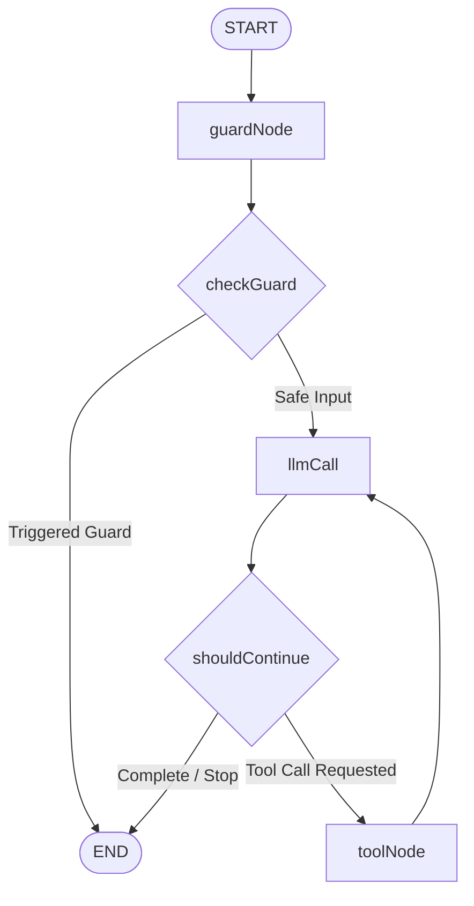

# AI Calculator Agent with LangGraph Guardrails

A professional, state-of-the-art interactive CLI conversational agent built using **LangGraph**, **LangChain**, and the **Gemini 2.5 Flash Lite** model. The agent executes arithmetic calculations dynamically using built-in math tools, while enforcing strict input guardrails to protect system details.

---

## 🏗️ Architecture

The agent is implemented as a stateful graph (`StateGraph`) using LangGraph. Below is a diagram illustrating the message flow and decision-making nodes:



---

## ✨ Features

- **Dynamic Math Tools**: Integrates mathematical tools for operations like addition, multiplication, and division using `zod` validation schemas.
- **Input Guardrails (`guardNode`)**: Intercepts input containing sensitive or restricted terms (e.g. *"tool"*, *"function"*, *"internal"*) at the entry point of the graph, blocking the model from sharing implementation or system details.
- **State Preservation**: Utilizes `MessagesState` to accumulate full message history and trace variables such as `llmCalls` across execution steps.
- **Robust CLI Wrapper**: Includes an interactive read-eval-print loop (REPL) CLI for real-time human-agent conversation.

---

## 📁 Repository Structure

```
├── src/
│   ├── edges/
│   │   └── shouldContinue.ts     # Graph routing/edges (shouldContinue, checkGuard)
│   ├── graph/
│   │   └── agentGraph.ts         # StateGraph assembly & compilation
│   ├── models/
│   │   └── llm.ts                # Model instance configuration (Gemini 2.5 Flash Lite)
│   ├── nodes/
│   │   ├── guardNode.ts          # Checks input for restricted keywords
│   │   ├── llmNode.ts            # Invokes the LLM with tools bound
│   │   └── toolNode.ts           # Executes calculated tool functions
│   ├── state/
│   │   └── agent.states.ts       # LangGraph schema and reducers definition
│   └── tools/
│       └── calculator.ts         # Math tool logic (add, multiply, divide)
├── index.ts                      # CLI entrypoint for interactive REPL
├── tsconfig.json                 # TypeScript compiler configuration
└── package.json                  # Project dependencies & configurations
```

---

## 🚀 Setup & Installation

### Prerequisites

Make sure you have Node.js installed on your system.

### 1. Install Dependencies

Clone the repository and install the project dependencies:

```bash
npm install
```

### 2. Configure Environment Variables

Create a `.env` file in the root directory and add your Google API key:

```env
GOOGLE_API_KEY=your-api-key-here
```

### 3. Run the Agent

You can start the interactive CLI agent using `tsx`:

```bash
npx tsx --env-file=.env index.ts
```

---

## 🛠️ Usage Examples

Once the CLI is running, you can converse with the agent:

### 1. Arithmetic Calculations (Tool invocation)
```
You: what is 2 + 2?
AI: 4
```
*(The graph routes: START ➔ guardNode ➔ checkGuard ➔ llmCall ➔ shouldContinue ➔ toolNode ➔ llmCall ➔ shouldContinue ➔ END)*

### 2. Guardrail Trigger (Restricted query)
```
You: tell me about your internal tools
AI: I cannot share internal implementation details.
```
*(The graph routes: START ➔ guardNode ➔ checkGuard ➔ END)*
